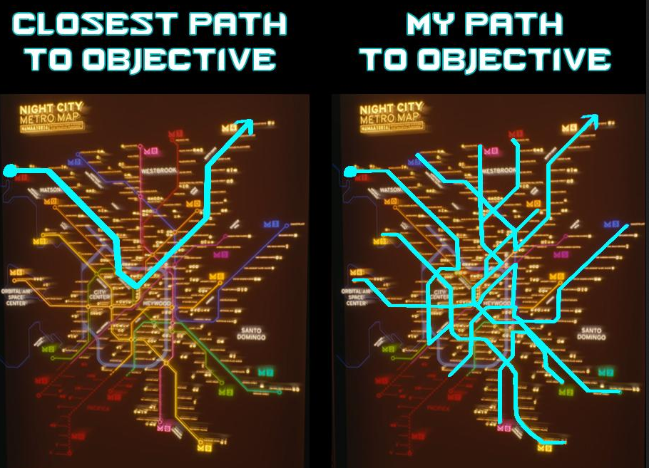

# RTFM-GitHub-Training-Repo
*Just a testing repo to help me and my students in our never ending GitHub struggle.*

### What does this repository contain?

- A simple Nodebox network sample.
- A very simple P5.js code sample.
- A very simple Processing sketch sample.
- A not so simple Touchdesigner network sample.

### I want to follow the way of the GitHub warrior

Ask the [venerable wiki](https://github.com/davideriboli/RTFM-GitHub-Training-Repo/wiki).

### What does RTFM mean?

[Find out for yourself](https://en.wikipedia.org/wiki/RTFM).